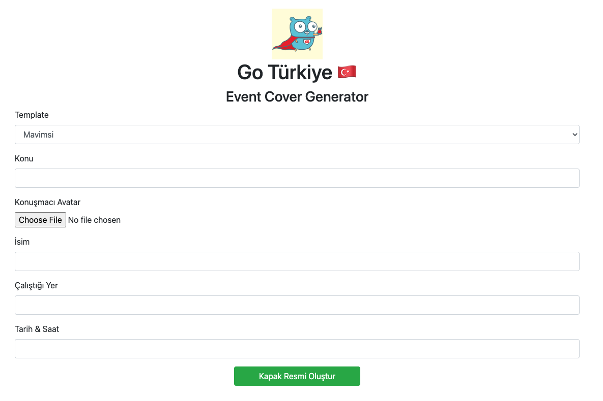

# Go Türkiye Cover Generator

Etkinliklerde değişen tek şey konuşmacıların konusu, ismi, nerede çalıştıklarıyla beraber
etkinliğin zamanı. 

Her etkinlikte değişen konuşmacılara göre yeniden yeniden etkinlik cover resmini elle oluşturmak
yerine neden bir png üretecek bir go servisi ile bunu yapmayalım? 

İster testlerden ister uygulamayı çalıştırıp doğrudan anasayfaya giderek
verdiğiniz bilgilere dayalı png resmi generate ettirebilirsiniz.

# Uygulamayı çalıştırmak

```bash
go run .
```

1323'de local bir http server ayağa kaldırılır. 

```localhost:1323/``` giderseniz aşağıdaki resme benzer sayfa göreceksiniz.



Buradan ilgili alanları doldurup resmi oluşturabilirsiniz ya da testleri doğrudan 
istediğiniz test data'sı ile çalıştırabilirsiniz.

# Testleri çalıştırmak

```bash
go test
```

Yaptıktan sonra root dizindeki /outputs klasörüne gidip generate edilen resimlere bakabilirsiniz.

# Teknik Detay

* Font, resimler, ve html sayfası için `go embed` kullanıldı.
* [Web framework olarak labstack/echo](https://github.com/labstack/echo)
* [2D rendering için fogleman/gg](https://github.com/fogleman/gg)
* [Font için golang/freetype](https://github.com/golang/freetype)
* [Konuşmacı avatarını bozmadan resize edebilmek için nfnt/resize](https://github.com/nfnt/resize)
